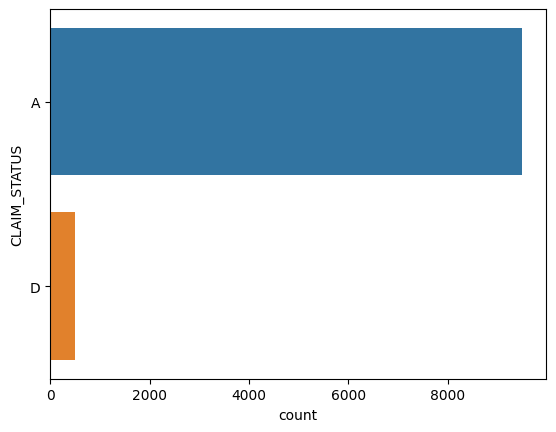
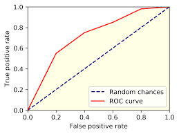
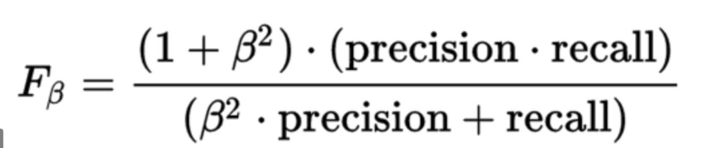
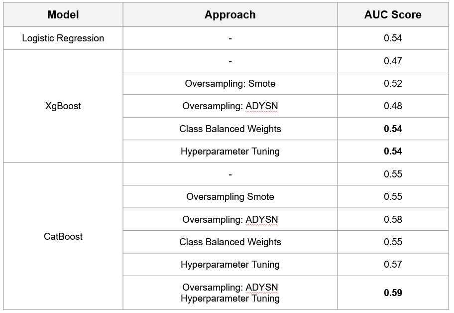
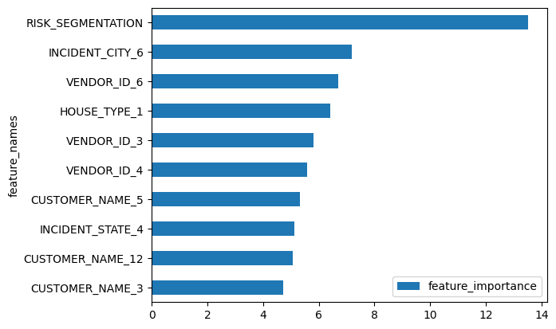
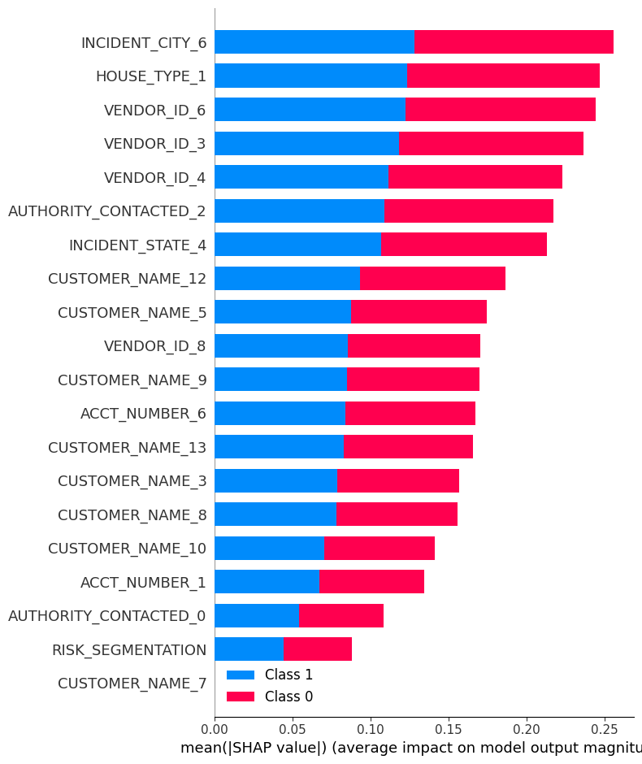

# insurance-fraud-detection

Author: Santosh Yadaw | [LinkedIn](https://www.linkedin.com/in/santosh-yadaw-b32025111/) | [Github](https://github.com/SantoshYadaw/)


## Table of contents
1. [Overview](#Overview)
2. [Usage](#usage)
3. [Exploratory Data Analysis](#exploratory-data-analysis)
4. [Metrics - ROC AUC](#metrics-roc-auc) 
5. [Model Performance](#model-performance)
6. [Insights](#insights)
7. [Future Work](#future-work)
8. [References](#references)

## Overview
In this assessment, we aim to accurately predict whether any given claim is fraduelent. This task is based on [Kaggle - Insurance Claims Fraud Data](https://www.kaggle.com/datasets/mastmustu/insurance-claims-fraud-data)

The codebase is written in python 3.8.16. Three models were considered:
 1. [Logistic Regression](https://scikit-learn.org/stable/modules/generated/sklearn.linear_model.LogisticRegression.html)
 2. [XGBoost](https://xgboost.readthedocs.io/en/stable/)
 3. [CatBoost](https://catboost.ai/)
 
Of the three models, 3. Catboost performed better in terms of both AUC score. 

## Usage
1. To build the environment:
```pip install -r requirements.txt```
2. Go into the data_preprocess folder:
```cd src/data_preprocess```
3. Preprocess the raw data: 
```python -m data_preprocess```
4. Go into the train folder:
```cd src/train```
5. Train the model:
```python -m src.train```
6. Prediction output will be stored in `results/trained_model_results.csv` and roc curve is stored in the same folder
7. Trained model will be stored in `models/trained_model` 

Configuration files for src/train can be found in [src/config](/src/config). [src](/src) supports Logistic Regression, XGBoost and CatBoost, to change model, simply update [src/config](/src/config).

## Exploratory Data Analysis
There are three datasets given:
1. Employee Data - this the master data of the employee ( a.k.a agents or adjusters ) working on the insurance claims
2. Vendor Data - this is the master data of the vendor who assist insurance company in investigating the claims
3. Claims Data - this is the claim level transaction details submitted by customer to the insurance company for re-imbursement

Exploratory Data Analysis notebook can be found in [case_study.ipynb](notebooks/case_study.ipynb). Please refer to the notebook for the details.

The dataset used for building the model is from the claims data - insurance.csv) where we aim to classify the `CLAIM_STATUS`. There are only two classes - `Class A` and `Class D`. As per the distribution plot below, we can see its an highly imbalanced classification problem with alot more samples in the dataset belonging to Class A than Class D. 

<p align="center">
  
  <br>                  
</p>

## Metrics - ROC AUC
ROC AUC stands for Receiver Operating Characteristic - Area Under Curve. The ROC curve is a graph showing the performance of a classification model at all classification thresholds. The curve consist of two parameters - True Positive Rate, and False Positive Rate. While AUC represents the Area under the ROC Curve.

<p align="center">
  
  <br>                  
</p>
 
The difference between ROC AUC vs other metrics such as Accuracy or F1 is that ROC chooses the best model, before any threshold tuning. In a classification problems, it is possible to tune the threshold in order to predict more positive class, or more negative class. Hence, it is possible for a model to produce many different Accuracy or F1, depending on threshold tuning. 

ROC AUC gets the performance of the model before any threshold tuning by looking at the trade off between True Positive Rate and False Positive Rate. A model with high ROC AUC means that the model performs well in all threshold tuning, and hence could be tuned to maximize any metrics, such as accuracy, F1/F0.5/F2. 

### Other Suggested Metrics - F0.5
In a situation of imbalance dataset - where only 6.7% positive class, it is useful to use a metric that takes into account both precision and recall, such as F-Score. A naive metric such as Accuracy will give a high score of 95.0% when a bad algorithm classify all instances with claim status A (not Fraud). 

In addition, it will be in our favour to priotise minmizing False Negatives (FN) as we do not want the Fradulent transactions to go away undetected. As such, Precision has to be favoured over recall - F0.5 score.

<p align="center">
  
  <br>                  
</p>
 
## Model Performance
Three models were experimented - Logistic Regression (baseline), XGBoost and CatBoost. To deal with the class imbalanced issue, we tried out several approaches such as Oversampling - SMOTE, Oversampling: ADYSN and Balancing the Class Weights. Finally, we also performed hyperparameter tuning.

1. Logistic Regression: We used the logistic regression as our baseline model. It achieved a auc score of 0.54.
2. XgBoost: The XgBoost model did not perform as well compared to the logistic regression model having an auc score of 0.47 at the baseline
 - Experimenting with oversampling method, SMOTE oversampling helped to improve the performance of the XgBoost model to an auc score 0.52. The oversampling methof of ADYSN did not work as well having a auc score of 0.48
 - Setting the class weights to be balaanced helped to improve the perforamnce of the XGBoost model by around 0.07 points as compared to the baseline XGBoost. 
3. Catboost: The CatBoost model performed better than the other two models at the baseline auc score of 0.55
 - Experimenting with oversampling methods like SMOTE and ADYSN, only the ADYSN technique helped to improve the performance of the model to 0.58
 - Hyperparameter tuning the parameters such as the `learning_rate`, `random_strength`, `depth` and `l2_leaf_reg` did help to improve the performance further to auc score of 0.57.
 - Combining using ADYSN oversampling method and Hyperparameter tuning, the CatBoost model achieved the highest auc score of 0.59. Hence , being the best model.

In summary, the best performance came from the CatBoost model with auc score of 0.58 after using Oversampling ADYSN and Hyperparameter tuning.  

<p align="center">
  
  <br>                  
</p>

## Insights
Based on feature importance of the best CatBoost model, the most important feature are `RISK_SEGMENTATION`, `INCIDENT_CITY_6`, and `VENDOR_ID_6` and `HOUSE_TYPE_1` while the least important features are the `CUSTOMER_NAMES`. 

<p align="center">
  
  <br>                  
</p>

<p align="center">
  
  <br>                  
</p>


## Future Work
- [ ] Using other loss functions to penalize the majority class
- [ ] Ensemble of models to improve overall score 
- [ ] Write test cases for function
- [ ] Hosting model and creating an API to serve model predictions

## References
- [Kaggle Competition - Insurance Claims Fraud](https://www.kaggle.com/datasets/mastmustu/insurance-claims-fraud-data))
- [Scikit-learn](https://scikit-learn.org/stable/)
- [XGBoost](https://xgboost.readthedocs.io/en/stable/)
- [CatBoost](https://catboost.ai/)
